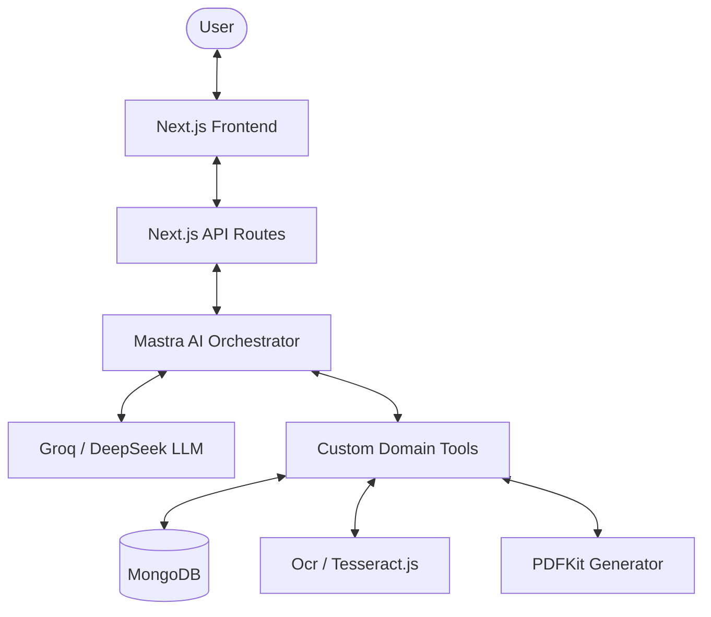

# Technical Architecture

This document outlines the high-level technical architecture of the Loan Assistant project.

## High-Level Overview

The system is designed as a **Multi-Agent Orchestration Platform** built on Next.js, leveraging AI for specialized tasks.

---

## Component Layers

### 1. Presentation Layer (Frontend)
- **Framework**: Next.js 16+ (App Router).
- **Styling**: Tailwind CSS 4.
- **UI State**: React Hooks (useState, useEffect) for managing chat flow and multi-stage application state.
- **Features**: Real-time chat, file upload with progress, dynamic PDF rendering.

### 2. Orchestration Layer (AI)
- **Framework**: [Mastra](https://mastra.ai/).
- **Agents**: A Central "Master Agent" handles the dialogue flow, maintains context, and decides when to trigger specific tools.
- **Decision Engine**: LLM (Groq) interprets user intent and maps it to tool executions.

### 3. Business Logic Layer (Tools)
- **Custom Tools**: Encapsulate specific domain logic (e.g., FOIR calculation, KYC verification).
- **Separation of Concerns**: Tools handle data validation and external service calls, keeping the agent's prompt clean.

### 4. Data Layer (Persistence)
- **Database**: MongoDB.
- **ORM**: Mongoose for schema definition and data validation.
- **Models**: User, Loan, KYC, and Credit.

---

## Security and Authentication

- **Authentication**: JWT-based stateless authentication.
- **Session Management**: Custom session manager tracks the user's progress through the loan stages (Sales → KYC → Credit → Selection → Docs).
- **Data Privacy**: Sensitive user information is stored securely in MongoDB and only accessed through authorized API endpoints.
