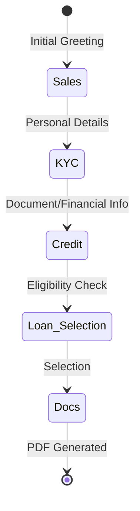
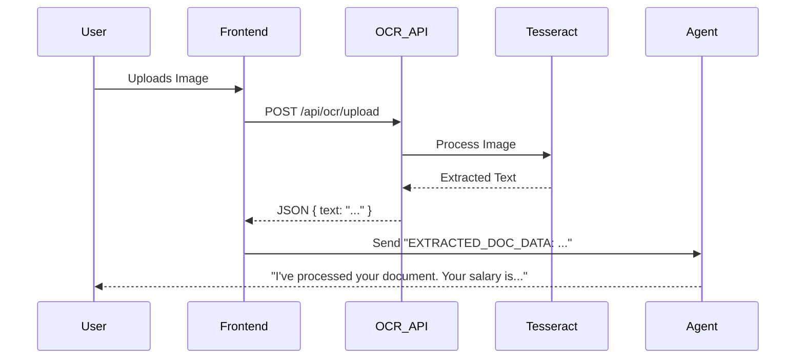
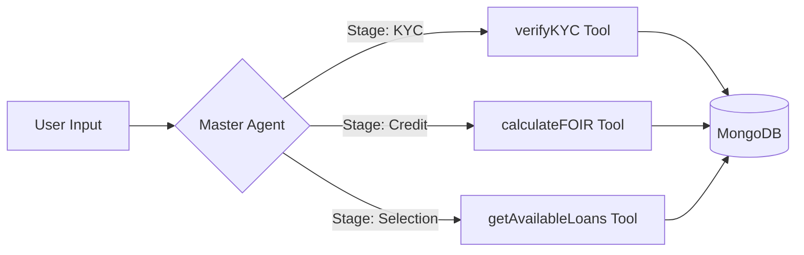

# Data Flow & Workflow

This document explains how data moves through the Loan Assistant application and the associated user workflows.

## 1. The 5-Stage Loan Workflow

The application guides users through a structured, multi-stage process managed by a stage-aware session manager.

- **Sales**: Introduction and basic intent gathering.
- **KYC**: Collection and verification of identity (email, phone, etc.).
- **Credit**: Assessment of financial health (salary, expenses, credit score).
- **Loan_Selection**: Matching user profile with available loan products.
- **Docs**: Summarizing the application and generating a formal PDF.

---

## 2. Document Extraction Flow (OCR)

When a user uploads an image (ID or Salary Slip), the following flow is triggered:

---

## 3. Agent-Tool Interaction

The Master Agent acts as a router, calling tools based on the current stage and user input.

---

## 4. Session Management

- **Persistence**: Sessions are managed using a `session-manager.ts` utility.
- **Context**: The `chat-memory.ts` ensures the agent remembers previous steps of the conversation within a session.
- **Transitions**: Stage transitions are triggered either by user actions or backend tool responses (e.g., successful KYC verification auto-promotes the user to the Credit stage).
