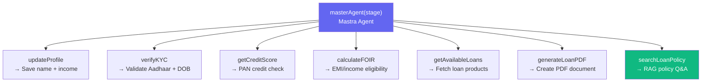
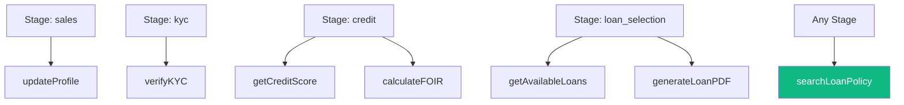
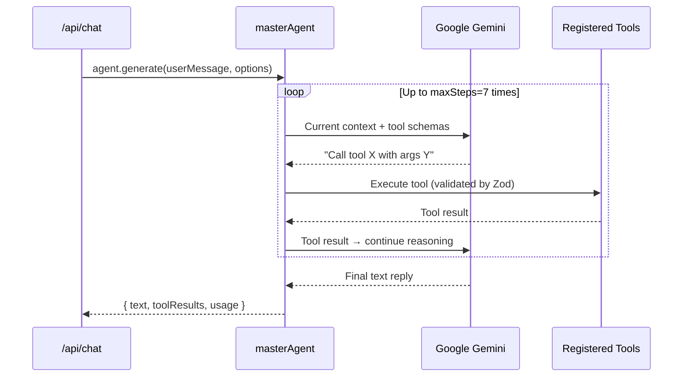
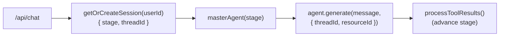

# 🧠 `src/mastra/agents/` — Agent Definitions

This folder contains the **Mastra Agent** definition for the application. Currently, the entire loan pipeline is handled by a single agent — the **Master Agent** — which dynamically adapts its behaviour based on the current stage of the user's session.

---

## `master.ts` — Master Agent Factory

The `masterAgent` is a **factory function** that returns a configured Mastra `Agent` instance. It accepts the current **stage** as a parameter so the system prompt changes dynamically per conversation turn.

```typescript
masterAgent(stage: string): Agent
```

---

## Agent Configuration

| Property | Value / Source | Notes |
|---|---|---|
| `name` | `"Master Agent"` | Internal identifier |
| `instructions` | `MasterAgentPrompt(stage)` | Dynamic — changes per stage |
| `model` | `PRIMARY_MODEL` (Google Gemini) | From `llms.ts` |
| `memory` | Mastra `LibSQLMemory` | Persistent thread-based memory |
| `maxSteps` | `7` | Max tool calls per single turn |
| `maxTokens` | `600` | Keeps replies concise |
| `temperature` | `0.5` | Balanced creativity & consistency |

---

## Tools Wired Into the Agent

All 7 tools from `src/mastra/tools/` are registered on the agent at instantiation. The LLM decides which to call based on context and stage instructions.



---

## Tool Trigger Map by Stage



| Tool | Primary Stage | Trigger Condition |
|---|---|---|
| `updateProfile` | `sales` | After collecting name + monthly income |
| `verifyKYC` | `kyc` | After collecting Aadhaar number + DOB |
| `getCreditScore` | `credit` | After user confirms PAN check |
| `calculateFOIR` | `credit` | After credit score passes (≥ 600) |
| `getAvailableLoans` | `loan_selection` | At start of loan selection stage |
| `generateLoanPDF` | `loan_selection` | After user picks a specific loan |
| `searchLoanPolicy` | **Any** | When user asks about rates, eligibility, EMI rules |

---

## Agent Execution Model



---

## Why a Single Agent?

Rather than creating separate agents for each stage (e.g., `SalesAgent`, `KYCAgent`), the architecture uses one `masterAgent` factory:

**Benefits:**
- ✅ **Consistent personality** — Aria's tone is uniform throughout the conversation
- ✅ **Simpler codebase** — one agent class to maintain and test
- ✅ **Cross-stage tool access** — `searchLoanPolicy` can answer policy questions at any stage without routing
- ✅ **Prompt-driven isolation** — stage restrictions are enforced at the prompt level via `STAGE_INSTRUCTIONS`

**Trade-offs:**
- The LLM technically has access to all tools at all stages (but the prompt forbids using wrong-stage tools)
- If the LLM ignores prompt stage restrictions, it could theoretically call `generateLoanPDF` during `sales` — this is mitigated by `processToolResults()` ignoring unexpected tool calls

---

## Agent Instantiation Flow


