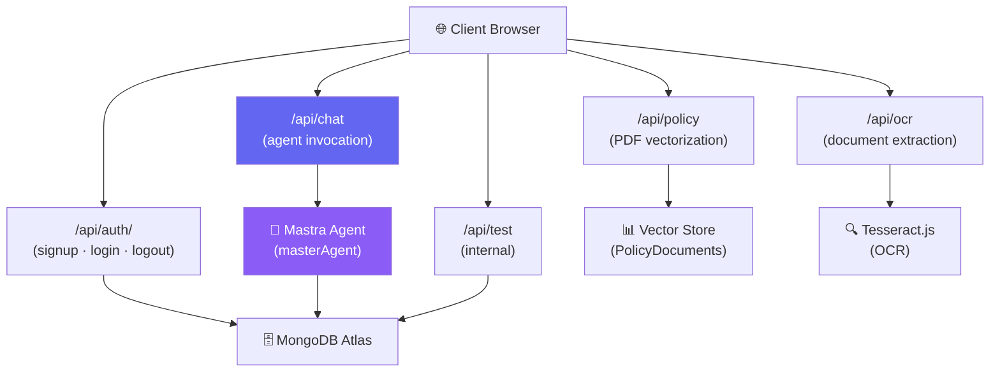
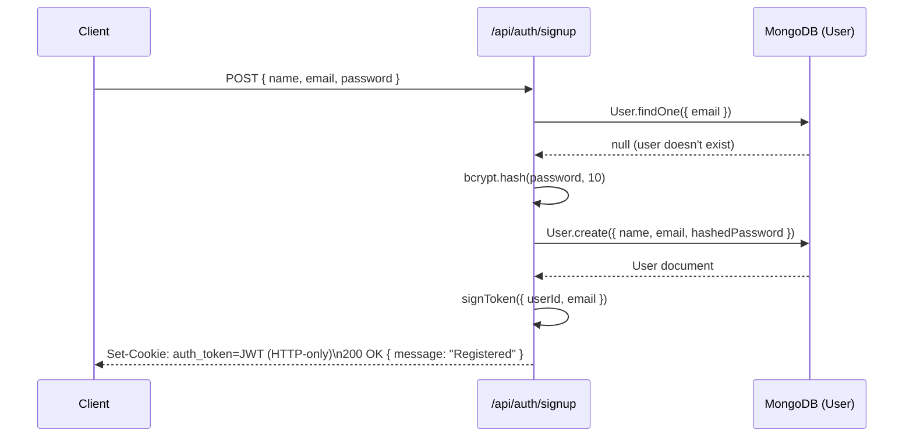
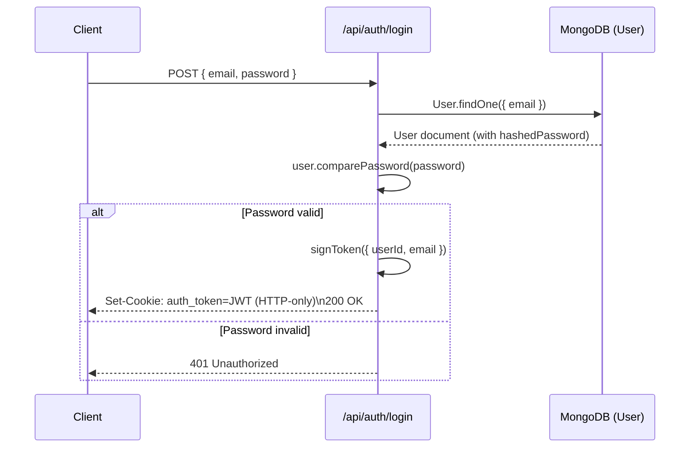
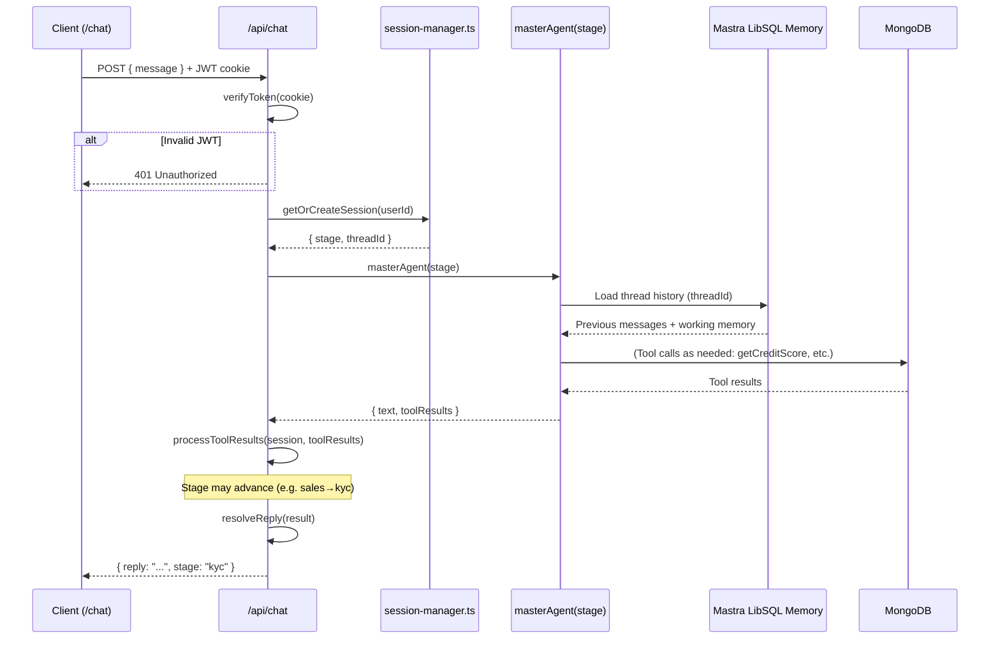
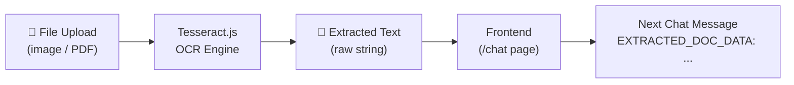
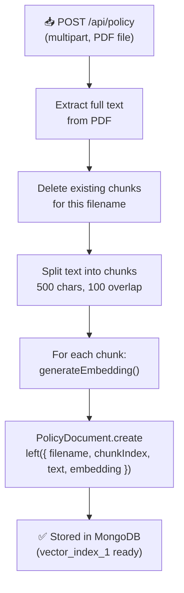
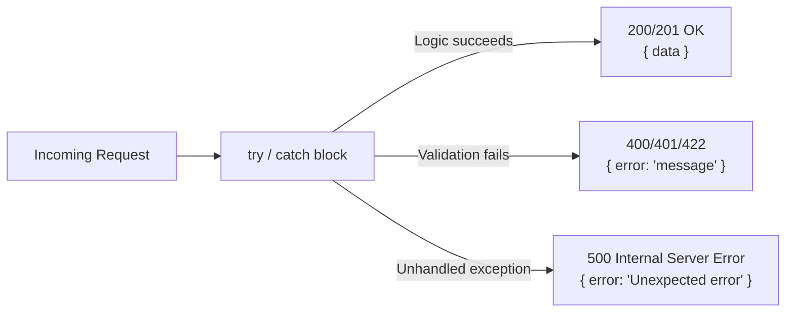

# 🔌 `src/app/api/` — Backend API Routes

All backend logic is fulfilled by **Next.js Route Handlers** (the App Router equivalent of `pages/api/`). Each sub-folder maps to a URL path under `/api/`. These are server-side functions that run in Node.js and connect to MongoDB, Mastra, and external services.

---

## Routes Overview

| Route | Method | Auth Required | Purpose |
|---|---|---|---|
| `/api/auth/signup` | POST | No | Create a new user account |
| `/api/auth/login` | POST | No | Authenticate and issue JWT |
| `/api/auth/logout` | POST | No | Clear the auth cookie |
| `/api/chat` | POST | ✅ Yes | Send a message to the Mastra agent |
| `/api/ocr` | POST | ✅ Yes | Extract text from uploaded documents |
| `/api/policy` | POST | ✅ Yes | Upload policy PDF and vectorize it |
| `/api/test` | GET/POST | No | Internal testing endpoint |

---

## API Architecture Overview



---

## `/api/auth/` — Authentication

Handles all authentication operations. Uses `bcryptjs` for password hashing and `jsonwebtoken` for JWT management.

### Signup Flow



### Login Flow



**Cookie Configuration:**
- `httpOnly: true` — Not accessible from JavaScript (XSS protection)
- `secure: true` — HTTPS only in production
- `sameSite: 'strict'` — CSRF protection

---

## `/api/chat` — Core Chat Handler

The most critical route. Handles a single conversational turn, invoking the Mastra agent.



**Detailed Internal Logic:**

| Step | Code | Description |
|---|---|---|
| 1 | `verifyToken(cookie)` | Reject unauthenticated requests |
| 2 | `getOrCreateSession(userId)` | Get/create in-memory session with `stage` and `threadId` |
| 3 | `masterAgent(stage)` | Instantiate agent with stage-specific system prompt |
| 4 | `agent.generate(message, { threadId, resourceId })` | Mastra handles memory & multi-step tool calling |
| 5 | `processToolResults()` | Inspect tool results to advance stage |
| 6 | `resolveReply()` | Extract user-facing text from Mastra result object |
| 7 | Return `{ reply, stage }` | JSON response to frontend |

---

## `/api/ocr` — Document Text Extraction

Accepts multipart form-data uploads and extracts text from images or PDFs.



**Supported formats:** JPEG, PNG, PDF (first page)

**Response:**
```json
{
  "extractedText": "Name: Rahul Kumar\nAadhaar: XXXX XXXX 1234\n..."
}
```

The frontend prepends `EXTRACTED_DOC_DATA: {extractedText}` to the user's next message, so the agent can read it without any extra UI prompts.

---

## `/api/policy` — PDF Vectorization Pipeline

Accepts PDF uploads from admin and processes them into the RAG vector store.



**Chunking Strategy:**

| Parameter | Value | Rationale |
|---|---|---|
| `CHUNK_SIZE` | 500 chars | Semantically focused per chunk |
| `CHUNK_OVERLAP` | 100 chars | Preserves context at boundaries |

---

## `/api/test` — Internal Testing Endpoint

An internal endpoint used to trigger individual test scenarios without going through the full UI.

**Purpose:**
- Inject fake KYC data
- Simulate credit score responses
- Trigger and observe full pipeline runs
- Useful during development and CI

**Usage:**
```bash
# Trigger a passing loan scenario
curl -X POST http://localhost:3000/api/test \
  -H "Content-Type: application/json" \
  -d '{ "scenario": "loanPassing" }'
```

---

## Error Handling Pattern

All routes follow a consistent error structure:


