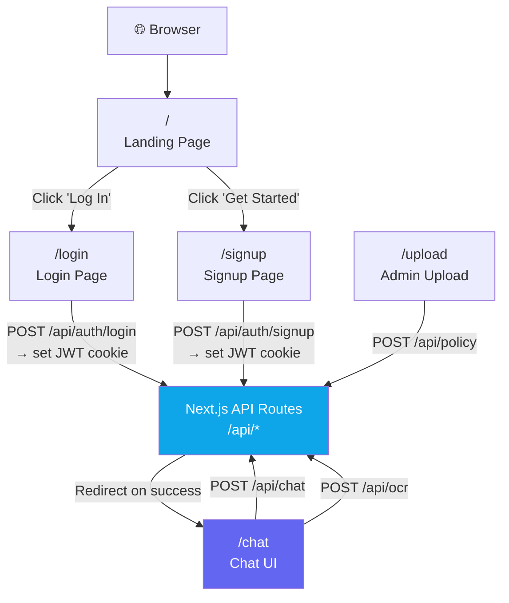
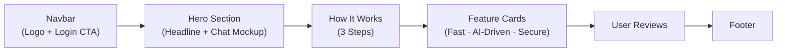
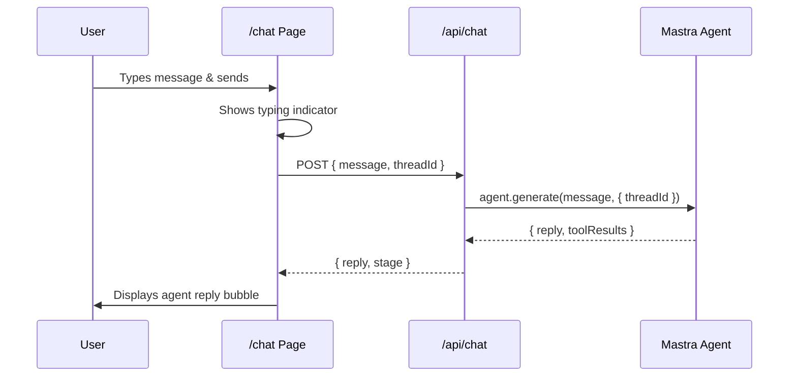
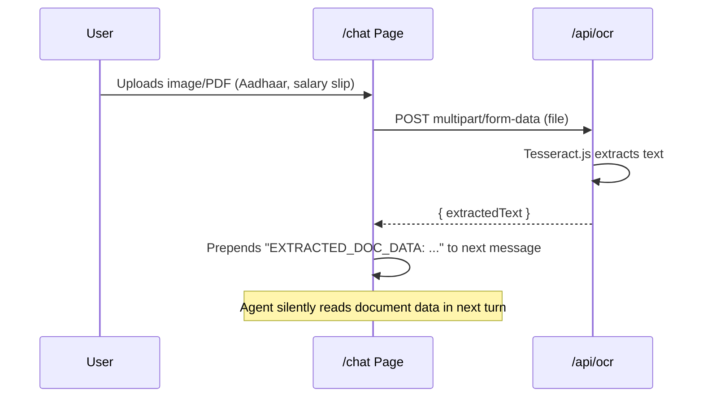
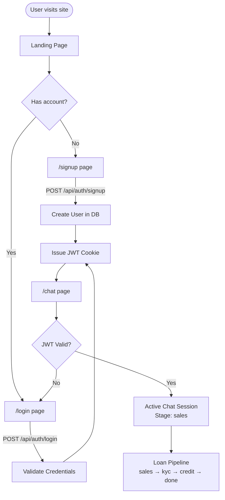

# 📱 `src/app/` — Next.js Pages & Routes

This is the top-level **Next.js App Router** directory. It contains all UI pages and the `api/` sub-directory for backend route handlers. Next.js uses the file system to determine routes — every folder with a `page.tsx` or `route.ts` becomes a URL path.

---

## Directory Structure

```
src/app/
├── layout.tsx          # Root layout (HTML shell, global font, OG metadata)
├── globals.css         # Tailwind base layers + CSS root variables
├── page.tsx            # "/" — Landing page (Finance Bot marketing page)
├── favicon.ico
│
├── login/              # "/login" — JWT-based login page
│   └── page.tsx
│
├── signup/             # "/signup" — User registration page
│   └── page.tsx
│
├── chat/               # "/chat" — Core chat UI (the loan assistant interface)
│   └── page.tsx
│
├── upload/             # "/upload" — Admin panel: upload loan policy PDFs
│   └── page.tsx
│
└── api/                # All backend API routes (see api.md)
    ├── auth/
    ├── chat/
    ├── ocr/
    ├── policy/
    └── test/
```

---

## Routing Architecture



---

## Pages

### `/` — Landing Page (`page.tsx`)

The public marketing page for "Finance Bot". Fully responsive and statically rendered.

**Sections:**
1. **Navigation Bar** — Logo + "Log In" / "Get Started" CTAs
2. **Hero Section** — Headline, subtitle, animated chat UI mockup
3. **"How It Works"** — 3-step explainer (Chat → Verify → Get Loan)
4. **Features Section** — Fast, AI-Driven, Secure
5. **User Reviews** — Social proof testimonials
6. **Footer** — Links + copyright



---

### `/login` — Login Page

Authentication page for returning users.

**Flow:**
1. User enters email + password.
2. Form POSTs to `/api/auth/login`.
3. Server validates credentials, issues a signed JWT, sets it as an HTTP-only cookie.
4. On success → redirect to `/chat`.
5. On failure → display error message inline.

---

### `/signup` — Registration Page

New user registration.

**Flow:**
1. User enters name, email, password.
2. Form POSTs to `/api/auth/signup`.
3. Server hashes password with `bcryptjs`, creates a `User` record in MongoDB.
4. Issues a JWT cookie and redirects to `/chat`.

---

### `/chat` — Main Chat Interface

The core application. A WhatsApp-style chat UI where the user interacts with **Aria** (the Master Agent).

**Features:**
- Message bubbles (user right, agent left)
- Typing indicator while waiting for agent response
- Document upload button — triggers OCR flow
- Stage-aware: the UI reflects the current pipeline stage
- Auto-scroll to latest message

**Message Send Flow:**



**Document Upload (OCR) Flow:**



---

### `/upload` — Admin PDF Upload

An internal/admin page to upload loan policy PDFs to the vector store.

**Flow:**
1. Admin selects a PDF file.
2. Form POSTs to `/api/policy` (multipart).
3. PDF text is extracted, chunked (500 chars, 100 overlap), embedded, and stored in MongoDB.
4. `searchLoanPolicy` tool can now answer policy questions using RAG.

---

## Global Files

| File | Purpose |
|---|---|
| `layout.tsx` | Root layout wrapping all pages. Sets `<html>`, `<body>`, Inter font via `next/font/google`, and Open Graph metadata |
| `globals.css` | Imports Tailwind base/components/utilities layers; defines CSS custom properties (color tokens, spacing) |

---

## Page Lifecycle & Authentication Flow


