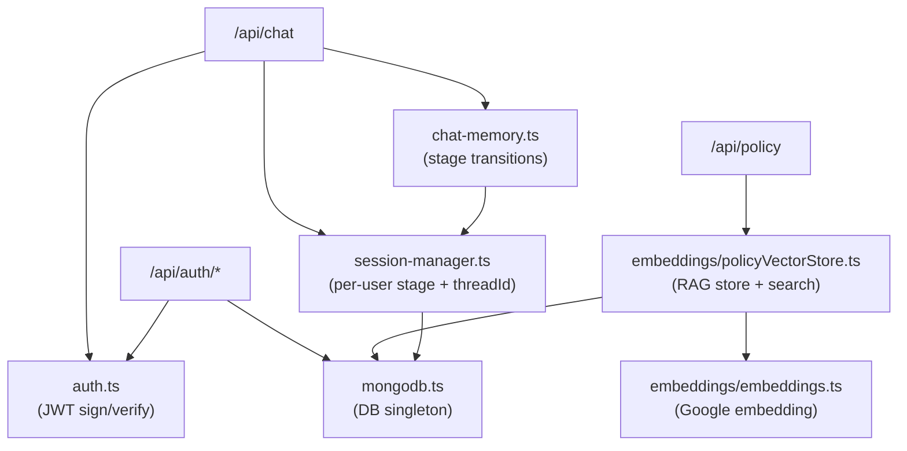
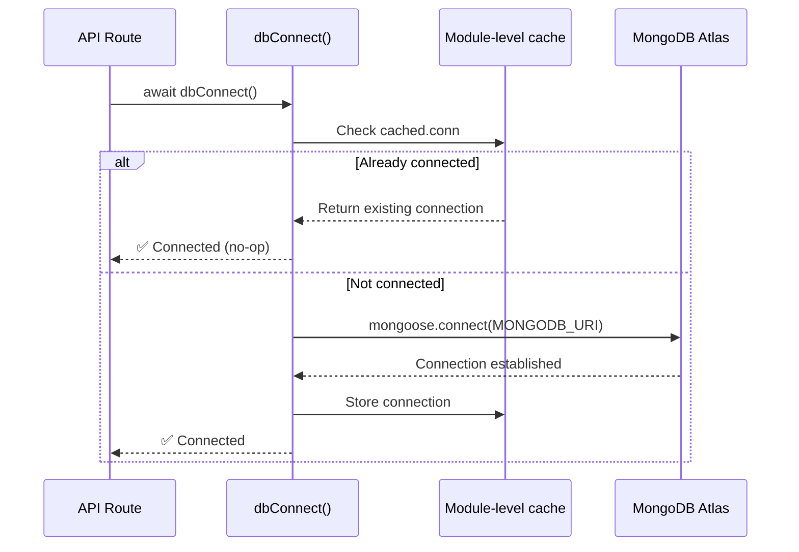
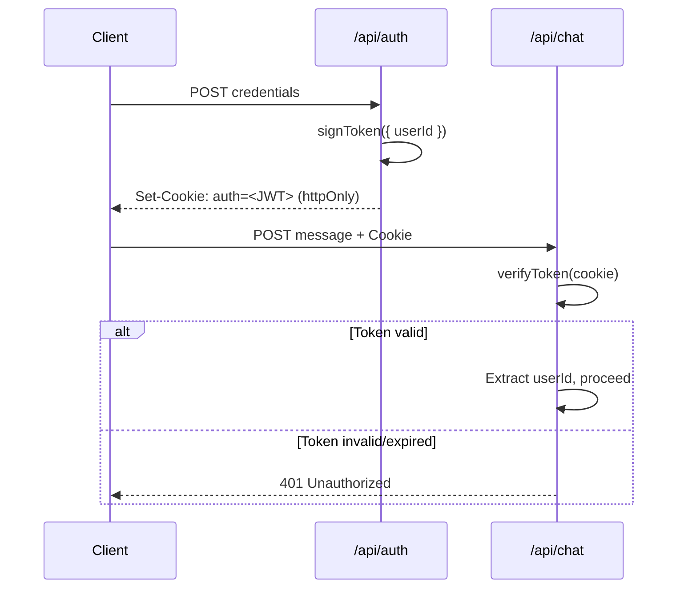
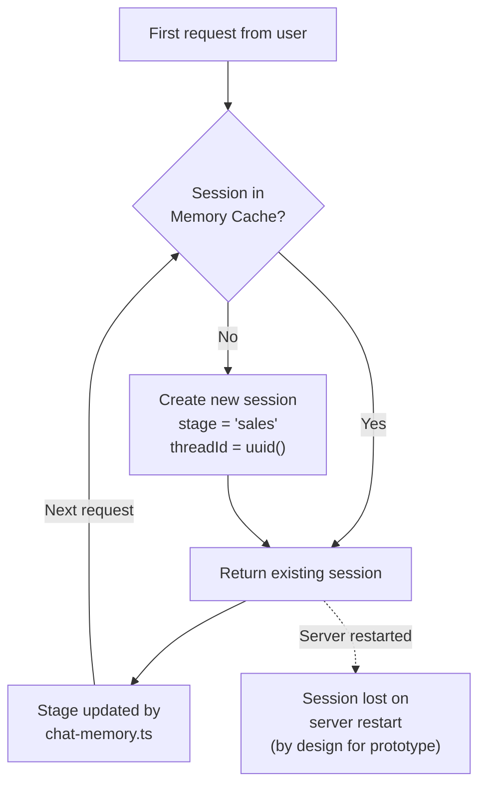
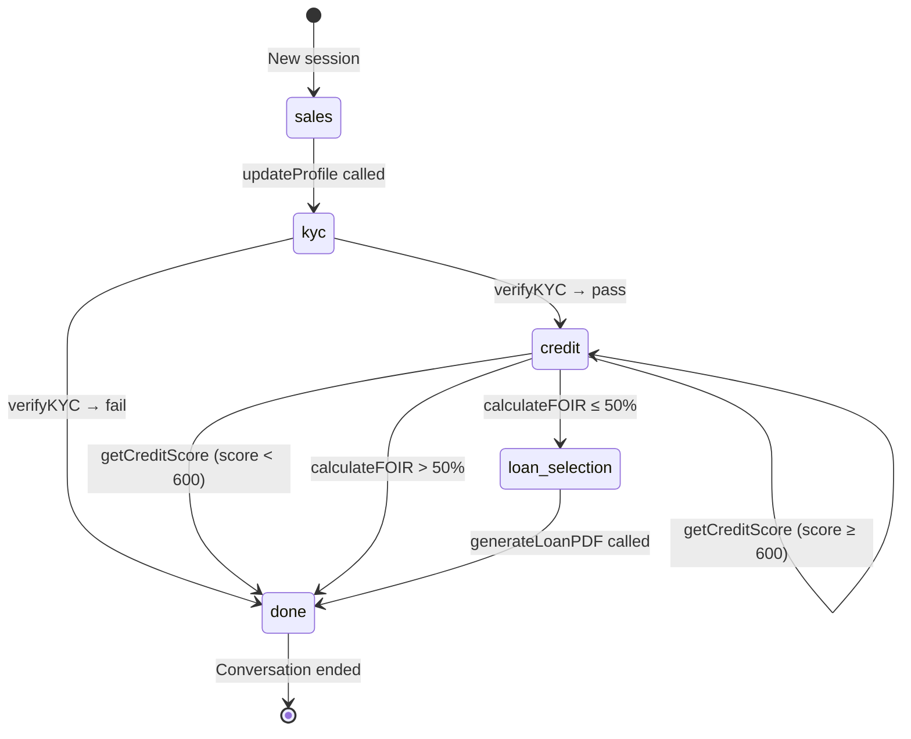
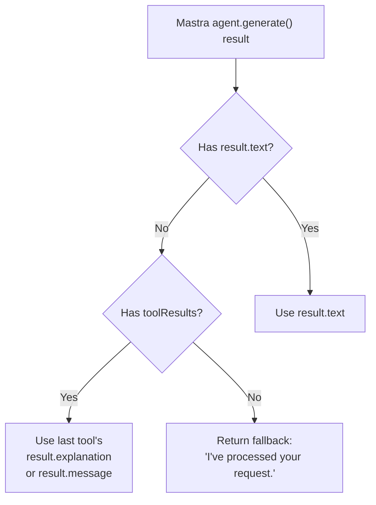
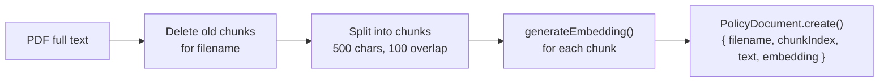
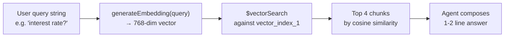

# 🗄️ `src/lib/` — Server-Side Utilities

The `lib` folder contains shared server-side utilities used by the API routes. These are not specific to any single route — they provide reusable infrastructure like database connectivity, authentication, session tracking, and chat memory processing.

---

## Directory Structure

```
src/lib/
├── auth.ts              # JWT creation and verification
├── mongodb.ts           # MongoDB connection singleton
├── session-manager.ts   # Per-user in-memory session state
├── chat-memory.ts       # Stage transition logic + reply extraction
│
└── embeddings/
    ├── embeddings.ts           # Google text-embedding model wrapper
    └── policyVectorStore.ts    # RAG: store + search policy documents
```

---

## Dependency Map



---

## `mongodb.ts` — Database Connection Singleton

A **connection singleton** that creates and caches a single Mongoose connection to MongoDB Atlas. All models and API routes import from here to avoid creating multiple connections per serverless invocation.

```typescript
import dbConnect from '@/lib/mongodb';
await dbConnect(); // idempotent — safe to call multiple times
```

**Why a singleton?**

Next.js runs in a serverless/edge environment where each request may spin up a new module context. Without caching, each request would open a new MongoDB connection, quickly exhausting Atlas's connection pool limit.



---

## `auth.ts` — JWT Authentication Utilities

Provides two core functions for JWT-based stateless authentication.

| Function | Input | Output | Description |
|---|---|---|---|
| `signToken(payload)` | `{ userId, email }` | JWT string | Signs token with `JWT_SECRET`, 7-day expiry |
| `verifyToken(token)` | JWT string | `{ userId, email }` | Verifies and decodes; throws on invalid/expired |

**JWT Lifecycle:**



---

## `session-manager.ts` — Per-User Session State

Manages an **in-memory server session** per authenticated user. The session stores the current pipeline stage and the Mastra memory thread ID.

### Session Object

| Field | Type | Description |
|---|---|---|
| `stage` | `string` | Current pipeline stage (`sales`, `kyc`, `credit`, `loan_selection`, `done`) |
| `threadId` | `string` | Mastra LibSQL thread ID — links this session to the AI's memory |

### Session Lifecycle



> **Note**: Sessions are keyed by user ID (from the JWT). Because this is in-memory, sessions reset on server restart — this is intentional for a prototype context. In production, sessions would be persisted in Redis or MongoDB.

---

## `chat-memory.ts` — Stage Transition Logic

Contains two critical functions used directly by `/api/chat`.

### `processToolResults(session, toolResults)`

The **state machine controller**. Inspects the list of tools that fired during an agent turn and advances the session stage accordingly.



**Stage Transition Table:**

| Tool Result | Old Stage | New Stage |
|---|---|---|
| `updateProfile` called | `sales` | `kyc` |
| `verifyKYC` → pass | `kyc` | `credit` |
| `verifyKYC` → fail | `kyc` | `done` |
| `getCreditScore` → score < 600 | `credit` | `done` |
| `calculateFOIR` → eligible (≤ 50%) | `credit` | `loan_selection` |
| `calculateFOIR` → ineligible (> 50%) | `credit` | `done` |
| `generateLoanPDF` called | `loan_selection` | `done` |
| `getAvailableLoans` called | `loan_selection` | `loan_selection` (no change) |

---

### `resolveReply(result)`

Extracts the final user-facing text from the Mastra agent result object, handling multiple response formats:



---

## `embeddings/` Sub-Folder

See [lib.md embeddings section](#embeddings-sub-folder) and the dedicated [mastra.md → RAG section](./mastra.md) for vector store details.

### `embeddings.ts` — Google Text Embedding Wrapper

```typescript
generateEmbedding(text: string): Promise<number[]>
```

- Uses the Google `text-embedding-004` model (768 dimensions)
- Wraps the Google AI SDK for consistent error handling
- Used both during **indexing** (when PDF is uploaded) and **querying** (when user asks a policy question)

### `policyVectorStore.ts` — Store & Search

**Store function** (`storePolicyDocument`):



**Search function** (`searchPolicyContext`):



**Fallback behavior:** If the Atlas vector index is unavailable (e.g., not yet built), `searchPolicyContext` falls back to returning the most recently uploaded chunks ordered by `uploadedAt` descending.
