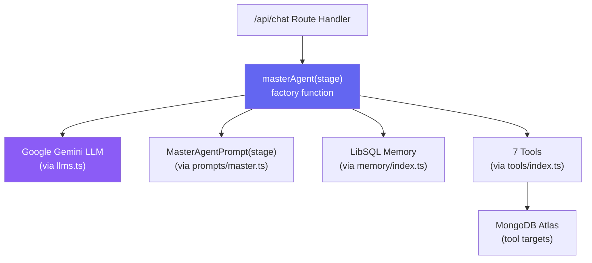
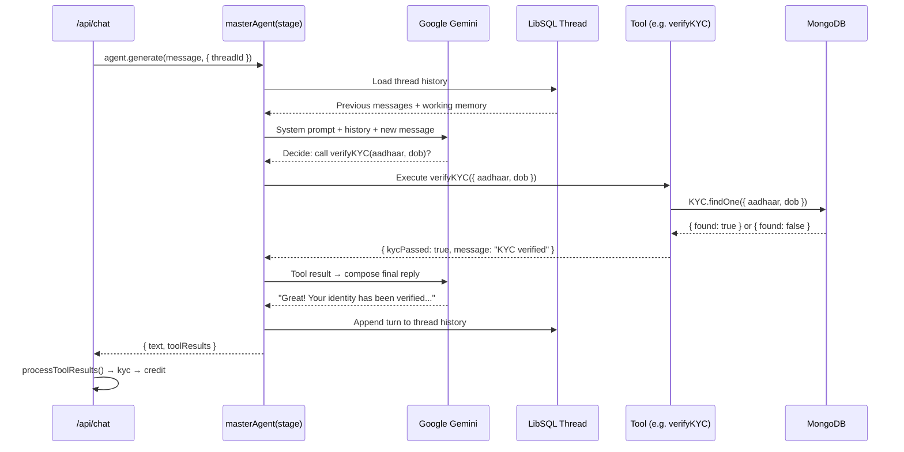
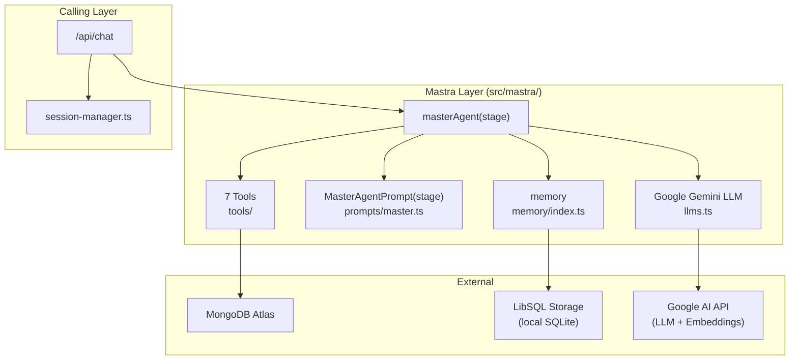

# 🤖 `src/mastra/` — AI Agent Layer

This folder contains everything related to the **Mastra AI agent framework**. It is the brain of the application, responsible for natural language conversation, tool execution, and persistent memory management across conversation turns.

---

## Directory Structure

```
src/mastra/
├── llms.ts               # LLM model configuration (Google Gemini)
│
├── agents/
│   └── master.ts         # The single Master Agent factory function
│
├── prompts/
│   └── master.ts         # Stage-aware system prompt builder
│
├── tools/
│   ├── index.ts          # Barrel export for all tools
│   ├── calculateFOIR.ts
│   ├── generateLoanPDF.ts
│   ├── getAvailableLoans.ts
│   ├── getCreditScore.ts
│   ├── searchLoanPolicy.ts
│   ├── updateProfile.ts
│   └── verifyKYC.ts
│
└── memory/
    └── index.ts          # Mastra LibSQL memory/thread configuration
```

---

## Mastra Framework Overview

**Mastra** (`@mastra/core`) is an agentic AI framework for TypeScript. It provides:

- **Agent abstraction** — wraps LLM calls with tool registration and multi-step reasoning
- **Working memory** — persistent thread-based memory using LibSQL (SQLite-compatible)
- **Tool system** — Zod-validated, typed tool definitions that the LLM can call
- **Multi-step execution** — the agent can call multiple tools in a single turn (`maxSteps: 7`)

---

## Component Architecture



---

## How a Single Chat Turn Works



---

## `llms.ts` — LLM Configuration

Defines and exports the LLM model instance(s) used by the agent.

| Export | Model | Provider | Purpose |
|---|---|---|---|
| `PRIMARY_MODEL` | `gemini-1.5-flash` | Google Gemini | Main reasoning model for the agent |

The model is configured with appropriate parameters for the loanCopilot use case:
- `temperature: 0.5` — Balanced between creativity and consistency
- `maxTokens: 600` — Keeps responses concise (enforced in prompts too)

---

## Sub-Folder Documentation

| Folder | Documentation |
|---|---|
| `agents/` | [agents.md](./agents.md) |
| `tools/` | [tools.md](./tools.md) |
| `prompts/` | [prompts.md](./prompts.md) |
| `memory/` | [memory.md](./memory.md) |

---

## Full Mastra Layer Data Flow



---

## Why a Single Agent?

One `masterAgent` is used across all six pipeline stages rather than separate agents per stage. This design choice:

- **Simplifies maintenance** — one agent class to update, not six
- **Ensures personality consistency** — Aria's tone and style are the same throughout
- **Reduces complexity** — stage-specific behaviour is encoded only in the system prompt via `STAGE_INSTRUCTIONS`
- **Enables cross-stage tools** — `searchLoanPolicy` works at any stage without routing logic
