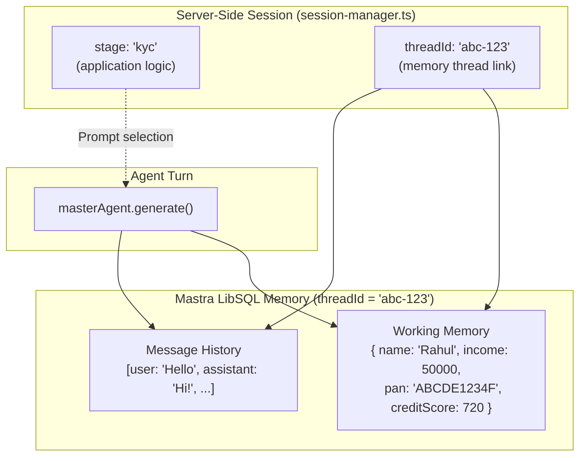
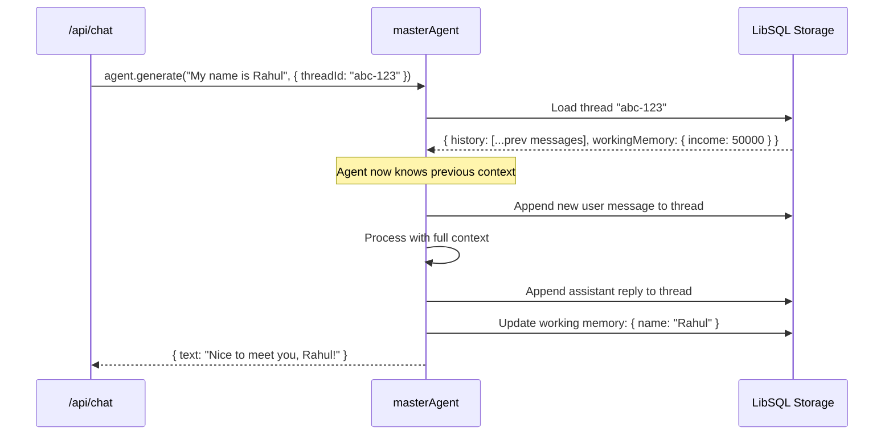
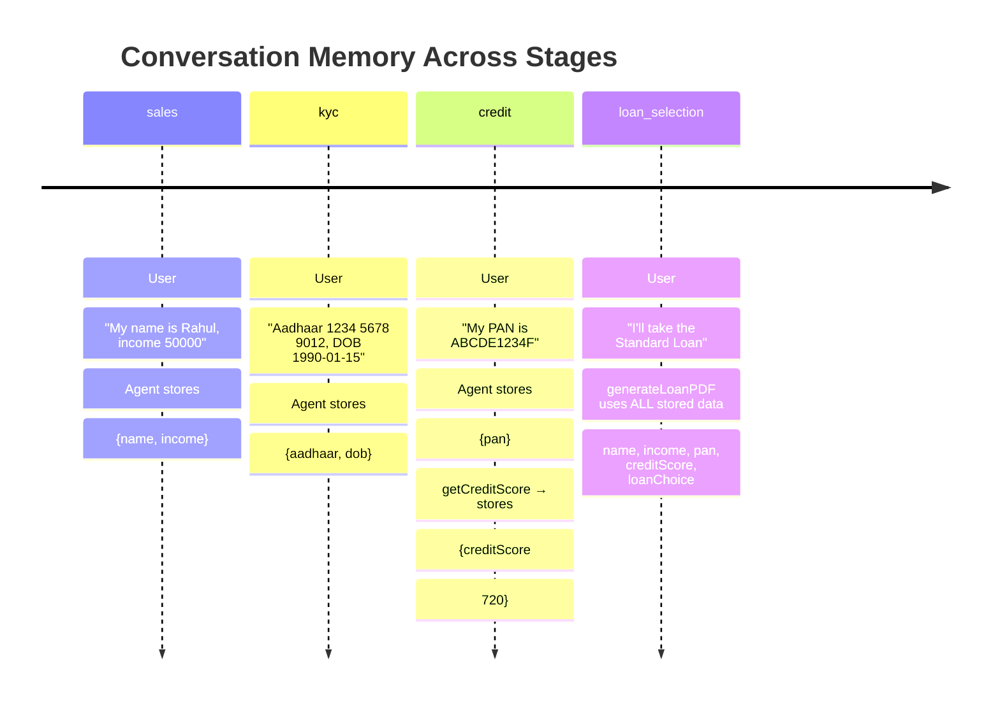
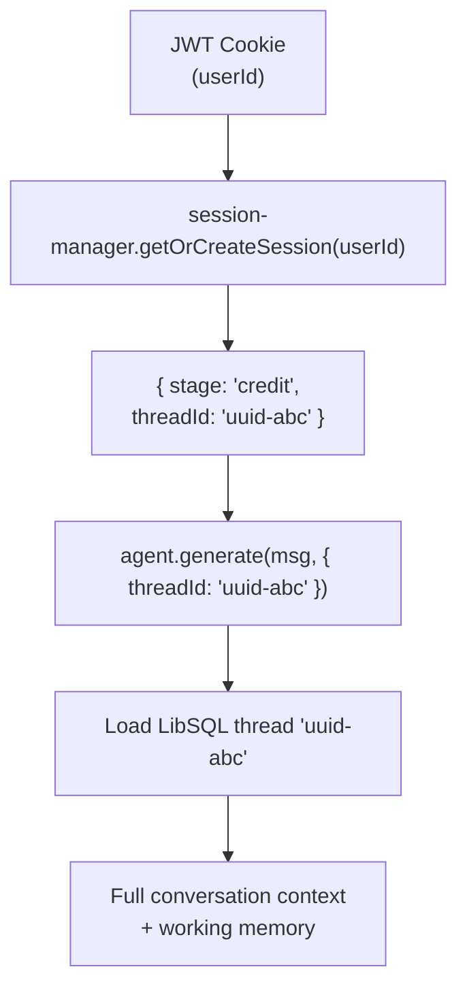

# 💾 `src/mastra/memory/` — Agent Memory Configuration

This folder configures the **persistent working memory** that the Mastra agent uses to remember conversation history and user data across multiple chat turns within the same session. Without this, the agent would forget everything the user said the moment the HTTP request ends.

---

## `index.ts`

Exports the `memory` object that is passed directly to the `Agent` constructor in `agents/master.ts`.

```typescript
import { memory } from '@/mastra/memory';
// Passed to masterAgent as: new Agent({ ..., memory })
```

---

## Memory Technology: LibSQL

Mastra's memory uses **LibSQL** (a SQLite-compatible library) to persist:

| Storage Layer | What It Stores |
|---|---|
| **Thread history** | Full chronological message log (user + assistant turns) tied to a `threadId` |
| **Working memory** | Structured key-value data the agent reads/writes within a thread (e.g., `name`, `income`, `pan`, `creditScore`, `selectedLoan`) |

---

## Memory Architecture



**Key distinction:** The **session** manages the stage state (application/business logic), while **Mastra memory** manages the conversational state (what the AI remembers and can reference). These are deliberately separate concerns.

---

## How Memory Is Used Per Turn



---

## Why Persistent Thread Memory?

Consider the loan application pipeline:



Without persistent memory, the agent would have to re-ask for the user's name at every stage. With LibSQL threads, it recalls everything from turn 1 when generating the PDF at turn 20+.

---

## Session ↔ Memory Relationship



- Each user gets **one session object** (in-memory on the server)
- The session contains one **`threadId`** (UUID string)
- The `threadId` maps to one **LibSQL thread** with all history and working memory
- A new session (server restart) creates a new `threadId` → fresh memory (intentional prototype behaviour)

---

## Working Memory Schema (Informal)

The agent writes and reads these keys in working memory throughout the pipeline:

| Key | Populated At Stage | Description |
|---|---|---|
| `name` | `sales` | User's full name |
| `income` | `sales` | Monthly income (₹) |
| `aadhaar` | `kyc` | 12-digit Aadhaar number |
| `dob` | `kyc` | Date of birth |
| `pan` | `credit` | PAN card number |
| `creditScore` | `credit` | Fetched credit score (0–900) |
| `foir` | `credit` | Calculated FOIR percentage |
| `selectedLoan` | `loan_selection` | Name of the chosen loan product |
| `pdfLink` | `done` | URL of the generated loan PDF |
