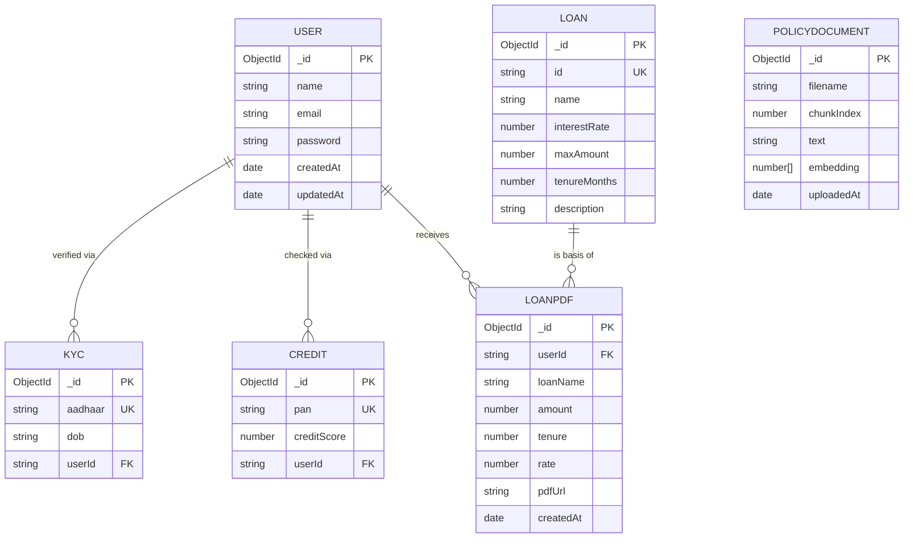
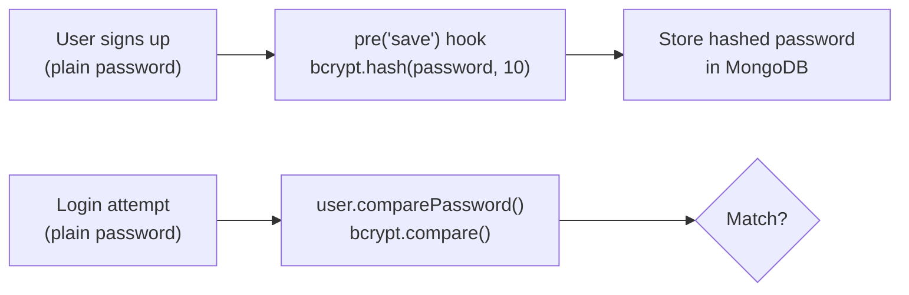
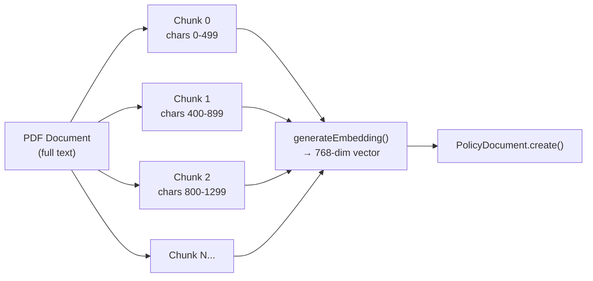
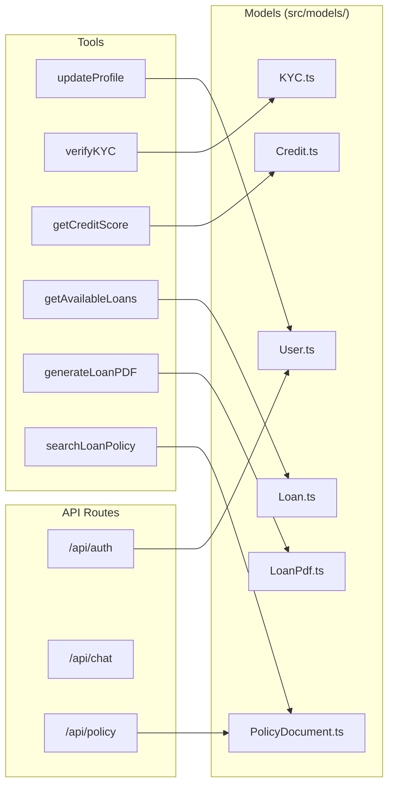

# 🗃️ `src/models/` — MongoDB Schemas (Mongoose)

This folder contains all **Mongoose model definitions**. Each file defines a schema and exports a cached model using the Next.js-safe pattern to avoid "Cannot overwrite model once compiled" errors during hot reloads and serverless invocations.

---

## Model Export Pattern (All Files)

```typescript
export default mongoose.models.ModelName || mongoose.model('ModelName', Schema);
```

This pattern checks if the model is already compiled (from a previous hot reload or serverless invocation) before creating a new one — critical for Next.js environments.

---

## Entity Relationship Diagram



---

## `User.ts` — User Account

The authenticated user account. Created during signup, referenced throughout the pipeline.

| Field | Type | Notes |
|---|---|---|
| `name` | `String` | Required |
| `email` | `String` | Required, unique |
| `password` | `String` | Hashed with bcrypt before save (`pre('save')` hook) |
| `createdAt` | `Date` | Auto-added via `timestamps: true` |
| `updatedAt` | `Date` | Auto-added via `timestamps: true` |

**Instance method:** `comparePassword(candidate: string): Promise<boolean>` — uses `bcrypt.compare` for secure login validation without ever decrypting the hash.

**Password hashing flow:**


---

## `Loan.ts` — Loan Products

Represents the loan products offered by the bank. Seeded into MongoDB manually or via an admin process.

| Field | Type | Notes |
|---|---|---|
| `id` | `String` | Unique product ID (e.g., "personal-standard") |
| `name` | `String` | Display name (e.g., "Standard Personal Loan") |
| `interestRate` | `Number` | Annual interest rate (%) |
| `maxAmount` | `Number` | Maximum disbursable amount (₹) |
| `tenureMonths` | `Number` | Repayment period in months |
| `description` | `String` | Short description shown to the user |

**Used by:** `getAvailableLoans` tool during `loan_selection` stage.

---

## `KYC.ts` — KYC Verification Records

Stores the ground-truth KYC data used to validate user identity during the KYC stage.

**Key fields:** `aadhaar` (12-digit), `dob` (YYYY-MM-DD format)

**Used by:** `verifyKYC` tool — the tool does `KYC.findOne({ aadhaar, dob })`. If no record is found, KYC fails.

> **Prototype note**: In production, this would call a government bureau API (e.g., UIDAI). Here, records are pre-seeded into MongoDB for testing different KYC scenarios.

---

## `Credit.ts` — Credit Score Data

Stores simulated credit score data keyed by PAN card number.

**Key fields:** `pan` (PAN string, unique), `creditScore` (number, 300–900 range)

**Used by:** `getCreditScore` tool — looks up the PAN, returns the score.

> **Prototype note**: In production, this integrates with a bureau API (CIBIL, Experian, Equifax). Records are pre-seeded for test scenarios (passing and failing scores).

---

## `LoanPdf.ts` — Generated PDF Records

Tracks loan application PDFs generated for users.

| Field | Type | Notes |
|---|---|---|
| `userId` | `String` | Reference to the user |
| `loanName` | `String` | Selected loan product name |
| `amount` | `Number` | Loan amount requested |
| `tenure` | `Number` | Repayment tenure (months) |
| `rate` | `Number` | Interest rate agreed upon |
| `pdfUrl` | `String` | Download URL for the generated PDF |
| `createdAt` | `Date` | Auto-added timestamp |

**Used by:** `generateLoanPDF` tool — creates a record after generating the PDF document.

---

## `PolicyDocument.ts` — Vectorized Policy Chunks

Stores chunked and embedded loan policy document data for RAG (Retrieval-Augmented Generation) search.

| Field | Type | Notes |
|---|---|---|
| `filename` | `String` | Source PDF filename (e.g., "loan_policy_document.pdf") |
| `chunkIndex` | `Number` | Position of this chunk in the original document |
| `text` | `String` | The raw text content of this chunk |
| `embedding` | `[Number]` | 768-dimensional vector embedding |
| `uploadedAt` | `Date` | Timestamp for fallback sorting |

**Atlas Vector Search Setup (Required):**

```json
{
  "fields": [
    {
      "type": "vector",
      "path": "embedding",
      "numDimensions": 768,
      "similarity": "cosine"
    }
  ]
}
```

Index name: `"vector_index_1"` (hardcoded in `policyVectorStore.ts`)

**Chunking diagram:**


(Chunks overlap by 100 characters to preserve context at boundaries)

---

## Model Usage Summary


