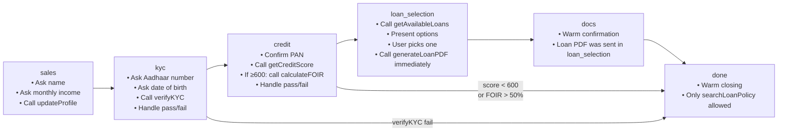
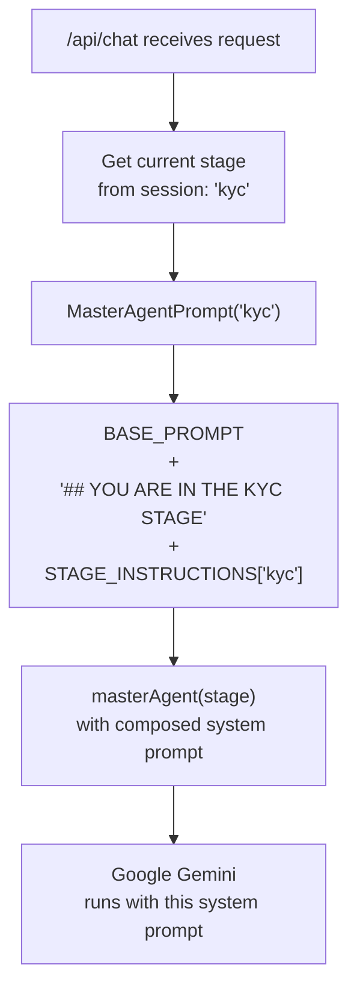
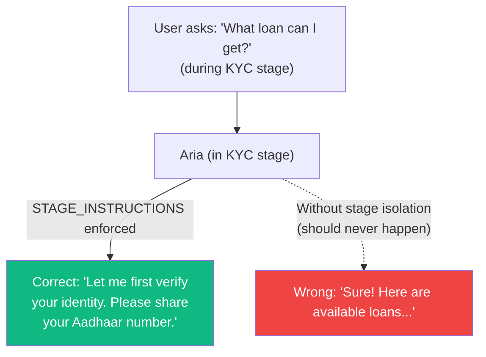

# 📝 `src/mastra/prompts/` — Agent System Prompts

This folder contains the **system prompt** that defines Aria's personality, operational rules, and stage-specific instructions. The prompt is dynamically constructed for every chat turn based on the user's current pipeline stage.

---

## `master.ts` — Prompt Builder

Exports three things: `BASE_PROMPT`, `STAGE_INSTRUCTIONS`, and `MasterAgentPrompt`.

---

## 1. `BASE_PROMPT` — Aria's Personality & Global Rules

The unchanging core of Aria's identity. Always prepended to every system prompt, regardless of stage.

### Personality
- **Name**: Aria
- **Tone**: Warm, friendly, concise — like texting a helpful friend, not a bank form
- **Style**: Max 3 lines per message, no bullet points, no markdown, no bold text in replies
- **Language**: Clear and conversational; no financial jargon

### Strict Rules

| Rule | Description |
|---|---|
| No repetition | Never say the same sentence twice in a conversation |
| Stage isolation | Never ask questions from other stages |
| No narration | Do not say "let me check your credit score…" — just call the tool and report the result |
| Final rejections | KYC fail or credit score < 600 → stop immediately, no further loan questions |
| Policy questions | At any stage → call `searchLoanPolicy`, give a 1–2 line answer, then resume current stage |

---

## 2. `STAGE_INSTRUCTIONS` — Per-Stage Job Definitions

A `Record<string, string>` dictionary mapping each stage name to its specific instructions. Each entry tells Aria its **single, narrow job** for that stage.



| Stage | Aria's Job |
|---|---|
| `sales` | Collect name + monthly income, then call `updateProfile` |
| `kyc` | Collect Aadhaar + DOB, call `verifyKYC`, handle pass/fail message |
| `credit` | Confirm PAN, call `getCreditScore` → if pass call `calculateFOIR` |
| `loan_selection` | Show loan options, wait for pick, generate PDF **immediately** |
| `docs` | Graceful warm confirmation (PDF was already sent) |
| `done` | Warm close message; only `searchLoanPolicy` is permitted |

---

## 3. `MasterAgentPrompt(stage)` — Final Prompt Builder

The exported factory function that composes the final system prompt:

```typescript
export const MasterAgentPrompt = (stage: string) =>
  `${BASE_PROMPT}

## YOU ARE IN THE ${stage.toUpperCase()} STAGE
${STAGE_INSTRUCTIONS[stage] ?? STAGE_INSTRUCTIONS['done']}`;
```

This is called every time `/api/chat` creates a new agent instance, ensuring the agent always gets the correct instructions for the current stage.

---

## Prompt Composition Flow



---

## Stage Isolation Design



The prompt design enforces **strict stage isolation** — Aria is forbidden from volunteering information about future steps or asking questions outside its current stage. This prevents the conversation from becoming:
- Confusing (users don't know what they're being asked for)
- Overwhelming (all questions at once)
- Incorrect (tool calls in wrong order break the state machine)

---

## Prompt Fallback

If `stage` is not a known key in `STAGE_INSTRUCTIONS`, the prompt falls back to `STAGE_INSTRUCTIONS['done']`:

```typescript
STAGE_INSTRUCTIONS[stage] ?? STAGE_INSTRUCTIONS['done']
```

This prevents crash scenarios where the session gets an unexpected stage value.

---

## Example Composed Prompt (KYC Stage)

```
You are Aria, a warm and friendly loanCopilot...
[BASE_PROMPT — personality, rules, format constraints]

## YOU ARE IN THE KYC STAGE
Your job right now is to collect the user's Aadhaar number and date of birth.
Once collected, call verifyKYC immediately.
If verifyKYC returns kycFailed: true, send a warm rejection message and stop.
Do not ask about loans, credit scores, or any other topics in this stage.
```
