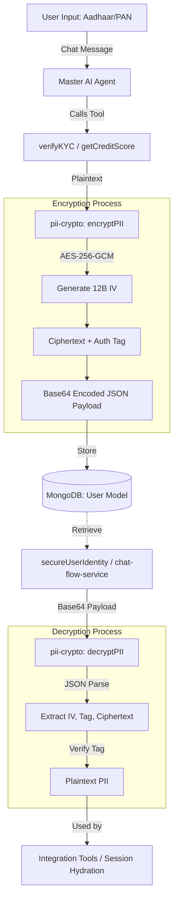

# 🔐 Secure Store (PII Encryption & Decryption)

This document outlines how **loanCopilot** handles sensitive Personally Identifiable Information (PII) using a robust encryption layer to ensure data privacy and compliance.

---

## 🛡️ Overview

To protect applicant privacy, sensitive identifiers like **PAN (Permanent Account Number)** and **Aadhaar Numbers** are never stored in plaintext within the database. Instead, they are encrypted at the application level before being persisted to MongoDB.

### Key Security Features:
- **AES-256-GCM**: Industry-standard authenticated encryption.
- **Unique IVs**: Every encryption operation uses a fresh 12-byte initialization vector.
- **Integrity Protection**: An authentication tag (GCM tag) ensures data hasn't been tampered with.
- **Environment-Locked Keys**: Encryption keys are managed via secure environment variables.

---

## 📊 Data Flow Diagram

The following flowchart illustrates the lifecycle of sensitive data from user input to secure storage and back.



---

## ⚙️ Technical Implementation

### Module: `src/lib/security/pii-crypto.ts`

The core logic resides in a dedicated security utility that leverages the Node.js `crypto` module.

#### 1. Encryption Algorithm
We use **AES-256-GCM** (Advanced Encryption Standard with Galois/Counter Mode). GCM provides both confidentiality and authenticity, ensuring that if the encrypted data is modified, decryption will fail.

#### 2. Data Format
Encrypted fields are stored as a base64-encoded JSON string:
```typescript
type EncryptedPayload = {
  iv: string;         // 12-byte initialization vector (base64)
  tag: string;        // 16-byte authentication tag (base64)
  ciphertext: string; // The encrypted data (base64)
};
```

#### 3. Key Management
The system requires a 32-byte (256-bit) encryption key:
- **Preferred**: `PII_ENCRYPTION_KEY` (64-char hex or 32-byte base64).
- **Fallback**: If the primary key is missing (dev/test), it derives a key by SHA-256 hashing the `NEXTAUTH_SECRET` or `JWT_SECRET`.

---

## 🔌 Connection Points

The secure store is integrated into several critical paths:

| Component | Operation | Purpose |
|---|---|---|
| **`verifyKYC` (Tool)** | `encryptPII` | Encrypts Aadhaar number before saving to User profile. |
| **`getCreditScore` (Tool)** | `encryptPII` | Encrypts PAN number before saving to User profile. |
| **`secureUserIdentity` (Util)** | `decryptPII` | Hydrates raw PAN/Aadhaar for tools to call external bureaus. |
| **`chat-flow-service` (Util)**| `decryptPII` | Recovers PAN to determine returning user eligibility. |

---

## 📝 Affected Parameters

The following fields in the **MongoDB `User` Schema** are protected by this system:

| Schema Field | Source Parameter | Description |
|---|---|---|
| `encryptedPan` | `pan` | User's 10-digit Permanent Account Number. |
| `encryptedAadhaar` | `aadhar_no` | User's 12-digit Aadhaar identification number. |

> [!NOTE]
> Database indexes on these fields are less effective for range queries but still support exact match lookups if the IV is deterministic (though we use random IVs for maximum security).

---

## 🛠️ Developer Usage

If you need to secure a new field, import the utilities:

```typescript
import { encryptPII, decryptPII } from '@/lib/security/pii-crypto';

// Encrypting
const secureData = encryptPII("SENSITIVE_VALUE");

// Decrypting
const originalValue = decryptPII(secureData);
```
