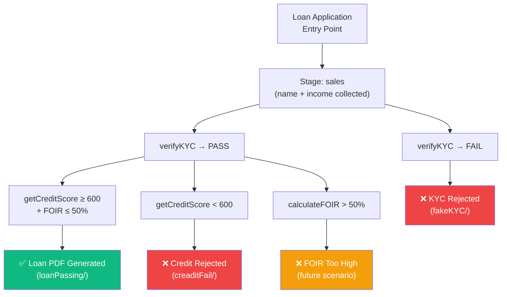
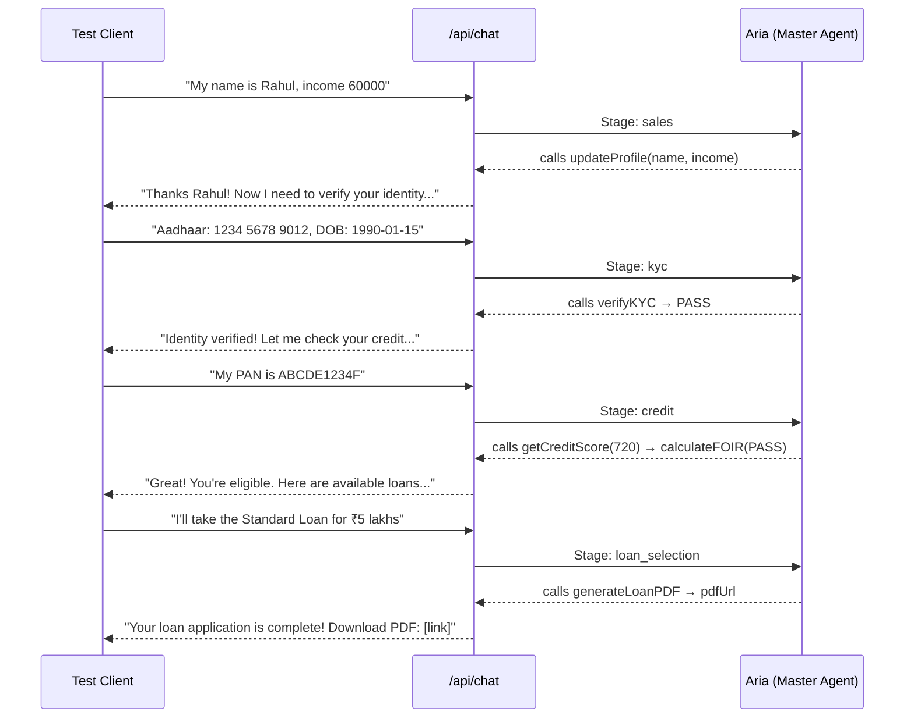
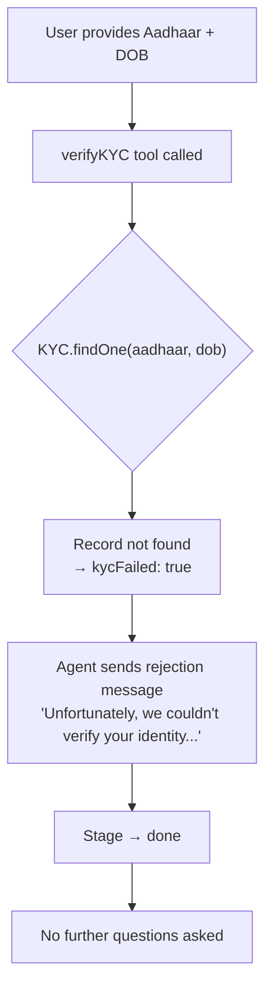
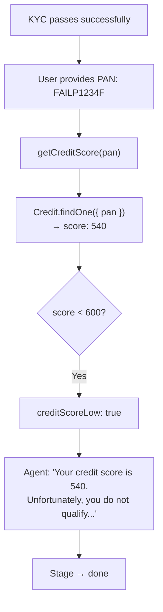
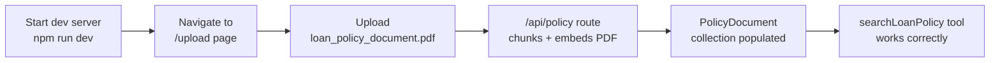

# 🧪 `test/` — Test Data & Scenarios

This folder contains test scenarios, fixtures, and a sample loan policy PDF used to manually test and verify the loan application pipeline — without needing to go through the live UI for each test run. It is essential for development-time debugging and regression testing.

---

## Directory Structure

```
test/
├── loan_policy_document.pdf    # Reference policy PDF for RAG seeding
│
├── loanPassing/                # ✅ Happy path: full approval flow
├── fakeKYC/                    # ❌ Failure path: KYC rejection
└── creaditFail/                # ❌ Failure path: Credit score rejection
                                # (note: "creadit" spelling preserved as-is)
```

---

## Test Coverage Map



---

## Scenario: `loanPassing/` — Happy Path ✅

A complete end-to-end success scenario where the user passes all verification gates and receives a loan PDF.

**Test Setup Requirements:**
- A `KYC` record exists in MongoDB matching the test Aadhaar + DOB
- A `Credit` record exists with PAN → credit score ≥ 600
- At least one `Loan` product exists in the `Loan` collection
- The test user has a monthly income resulting in FOIR ≤ 50%

**Expected Pipeline:**


**What to Verify:**
- [ ] All 6 stages complete in sequence
- [ ] Tools called in order: `updateProfile` → `verifyKYC` → `getCreditScore` → `calculateFOIR` → `getAvailableLoans` → `generateLoanPDF`
- [ ] Agent provides a PDF download link in the final message
- [ ] Stage in session is `done` after completion

---

## Scenario: `fakeKYC/` — KYC Failure ❌

A test case where the user provides an Aadhaar/DOB combination that does **not** exist in the `KYC` collection, causing identity verification to fail.

**Test Setup:**
- The test Aadhaar number is **not** seeded in the `KYC` MongoDB collection
- OR the DOB doesn't match the Aadhaar record

**Expected Flow:**


**What to Verify:**
- [ ] Agent immediately sends a warm rejection message
- [ ] Stage advances to `done`
- [ ] No credit score questions are asked
- [ ] Subsequent messages only allow `searchLoanPolicy`

---

## Scenario: `creaditFail/` — Credit Score Failure ❌

> **Note**: The folder name `creaditFail` (with the typo) is preserved as-is from the codebase.

A test case where the user's PAN maps to a credit score **below 600** in the `Credit` collection.

**Test Setup:**
- A `KYC` record exists (so KYC passes)
- A `Credit` record exists with PAN → credit score < 600 (e.g., `540`)

**Expected Flow:**


**What to Verify:**
- [ ] Agent quotes the **actual credit score** in the rejection message
- [ ] Stage advances to `done` immediately
- [ ] No loan options are presented
- [ ] The message is warm and not harsh

---

## `loan_policy_document.pdf` — Policy PDF for RAG Testing

A reference PDF file containing simulated bank loan policies: interest rates, eligibility rules, FOIR limits, tenure options, prepayment penalties, etc.

**How to use in testing:**



1. Start the dev server: `npm run dev`
2. Navigate to `http://localhost:3000/upload`
3. Upload the PDF file from this folder
4. The `/api/policy` route processes, chunks, and embeds it
5. Now `searchLoanPolicy` can answer policy questions during chat

---

## Running Tests via `/api/test`

The `/api/test` endpoint can trigger individual scenarios programmatically without UI interaction:

```bash
# Trigger a scenario from the command line (dev server must be running)
curl -X POST http://localhost:3000/api/test \
  -H "Content-Type: application/json" \
  -d '{ "scenario": "loanPassing" }'

# Or for KYC failure:
curl -X POST http://localhost:3000/api/test \
  -d '{ "scenario": "fakeKYC" }'
```

---

## Test Checklist

| Scenario | Stages Tested | Expected Outcome |
|---|---|---|
| `loanPassing` | All 6 stages | ✅ PDF generated, link returned |
| `fakeKYC` | sales, kyc | ❌ Rejected at KYC, stage = done |
| `creaditFail` | sales, kyc, credit | ❌ Rejected at credit, stage = done |
| Policy Q&A | Any stage | ✅ `searchLoanPolicy` returns grounded answer |
| FOIR > 50% | sales, kyc, credit | ❌ Rejected at FOIR check, stage = done |
