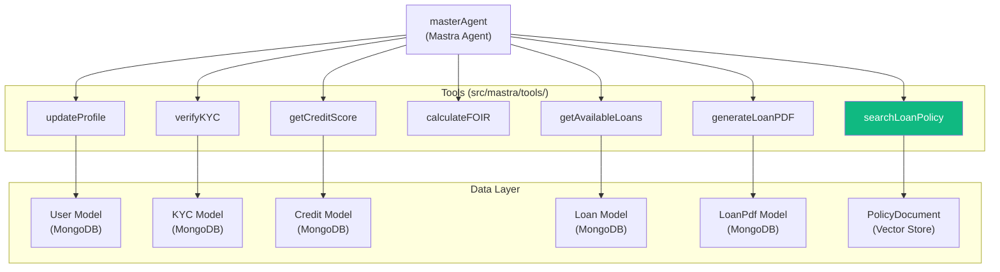
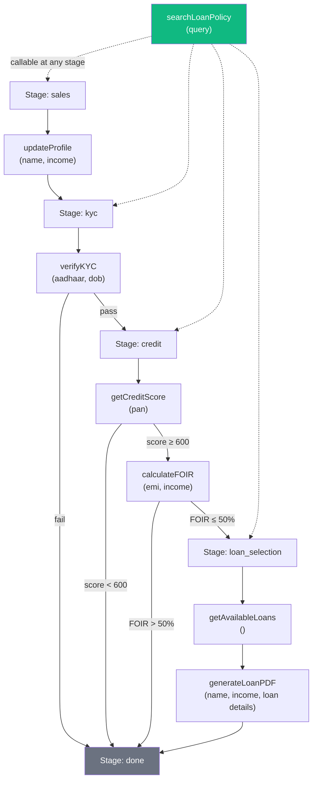
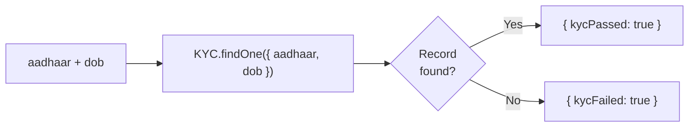
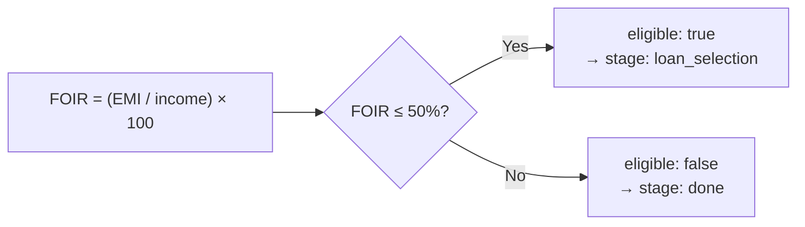
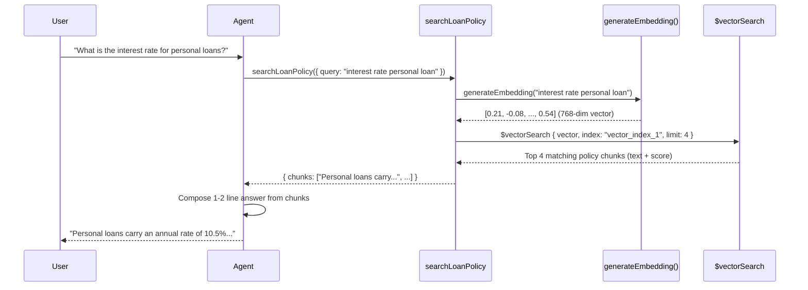

# 🔧 `src/mastra/tools/` — Agent Tools

Tools are the actions the Mastra agent can perform. Each tool is a TypeScript function decorated with a Mastra `createTool()` wrapper that provides a name, description, and Zod input/output schema. The agent decides which tools to call based on the current stage instructions and user input.

---

## Tool Index

| File | Tool Name | Stage | What It Does |
|---|---|---|---|
| `updateProfile.ts` | `updateProfile` | `sales` | Saves user name and monthly income to MongoDB user session |
| `verifyKYC.ts` | `verifyKYC` | `kyc` | Validates Aadhaar + DOB against the KYC collection |
| `getCreditScore.ts` | `getCreditScore` | `credit` | Fetches/simulates a credit score using the user's PAN |
| `calculateFOIR.ts` | `calculateFOIR` | `credit` | Calculates Fixed Obligation to Income Ratio (EMI / income) |
| `getAvailableLoans.ts` | `getAvailableLoans` | `loan_selection` | Queries the Loan collection and returns available products |
| `generateLoanPDF.ts` | `generateLoanPDF` | `loan_selection` | Generates a PDF loan document and stores the download link |
| `searchLoanPolicy.ts` | `searchLoanPolicy` | **Any** | RAG vector search on policy docs to answer Q&A |
| `index.ts` | — | — | Barrel export of all tools |

---

## Tool Architecture Overview



---

## Tool Flow Through the Pipeline



---

## Tool Descriptions

### `updateProfile` — Sales Stage

Persists the user's basic profile data collected during the sales stage.

**Input Schema:**
| Field | Type | Description |
|---|---|---|
| `name` | `string` | User's full name |
| `income` | `number` | Monthly income in ₹ |

**Output:**
```json
{ "success": true, "message": "Profile saved." }
```

**Example trigger:** User says "My name is Rahul and I earn ₹50,000 per month."

---

### `verifyKYC` — KYC Stage

Looks up the Aadhaar + DOB combination in the `KYC` MongoDB collection to verify identity.

**Input Schema:**
| Field | Type | Description |
|---|---|---|
| `aadhaar` | `string` | 12-digit Aadhaar number |
| `dob` | `string` | Date of birth (YYYY-MM-DD) |

**Output:**
```json
// Pass
{ "kycPassed": true, "message": "Identity verified successfully." }
// Fail
{ "kycFailed": true, "message": "We couldn't verify your identity." }
```

**Decision flow:**


---

### `getCreditScore` — Credit Stage

Simulates fetching a credit score from a bureau (CIBIL/Experian equivalent) by looking up the PAN in the `Credit` MongoDB collection.

**Input Schema:**
| Field | Type | Description |
|---|---|---|
| `pan` | `string` | PAN card number (e.g., ABCDE1234F) |

**Decision:**
- Score ≥ 600 → eligible, proceed to `calculateFOIR`
- Score < 600 → `creditScoreLow: true`; agent sends rejection, stage → `done`

---

### `calculateFOIR` — Credit Stage

**FOIR (Fixed Obligation to Income Ratio)** = (Total existing EMIs) ÷ (Monthly income) × 100

A FOIR below 50% indicates the user can afford a new loan EMI.

**Input Schema:**
| Field | Type | Description |
|---|---|---|
| `existingEMI` | `number` | Total current monthly obligations (₹) |
| `income` | `number` | Monthly income (₹) |

**Decision:**


---

### `getAvailableLoans` — Loan Selection Stage

Queries the `Loan` MongoDB collection and returns all available loan products.

**Output (array of):**
| Field | Type | Description |
|---|---|---|
| `id` | `string` | Unique product ID |
| `name` | `string` | e.g., "Standard Personal Loan" |
| `interestRate` | `number` | Annual rate (%) |
| `maxAmount` | `number` | Max disbursable (₹) |
| `tenureMonths` | `number` | Repayment period (months) |
| `description` | `string` | Short description |

---

### `generateLoanPDF` — Loan Selection Stage

Generates a professional PDF loan application document and saves it to disk or cloud storage.

**Input Schema:**
| Field | Type | Description |
|---|---|---|
| `name` | `string` | Applicant name |
| `income` | `number` | Monthly income |
| `loanName` | `string` | Selected loan product name |
| `amount` | `number` | Requested loan amount |
| `tenure` | `number` | Repayment tenure (months) |
| `rate` | `number` | Interest rate |

**Output:** `{ pdfUrl: "https://..." }` — The agent returns this URL in the reply message.

---

### `searchLoanPolicy` — Any Stage ⭐

The RAG tool. Runs a semantic vector search on uploaded policy documents to answer user questions grounded in actual bank policy.



---

## `index.ts` — Barrel Export

A clean barrel export that re-exports all tools for importing in `master.ts`:

```typescript
export * from './calculateFOIR';
export * from './generateLoanPDF';
export * from './getAvailableLoans';
export * from './getCreditScore';
export * from './searchLoanPolicy';
export * from './updateProfile';
export * from './verifyKYC';
```

---

## Tool Design Principles

1. **Zod-validated inputs** — Every tool input is validated by a Zod schema. The LLM cannot pass malformed data.
2. **Explicit output schemas** — The agent knows exactly what shape to expect from each tool.
3. **Idempotent where possible** — `updateProfile` can be called multiple times; latest data wins.
4. **Graceful failure** — Each tool returns structured error objects (e.g., `{ kycFailed: true }`) rather than throwing, so the agent can compose a user-friendly message.
